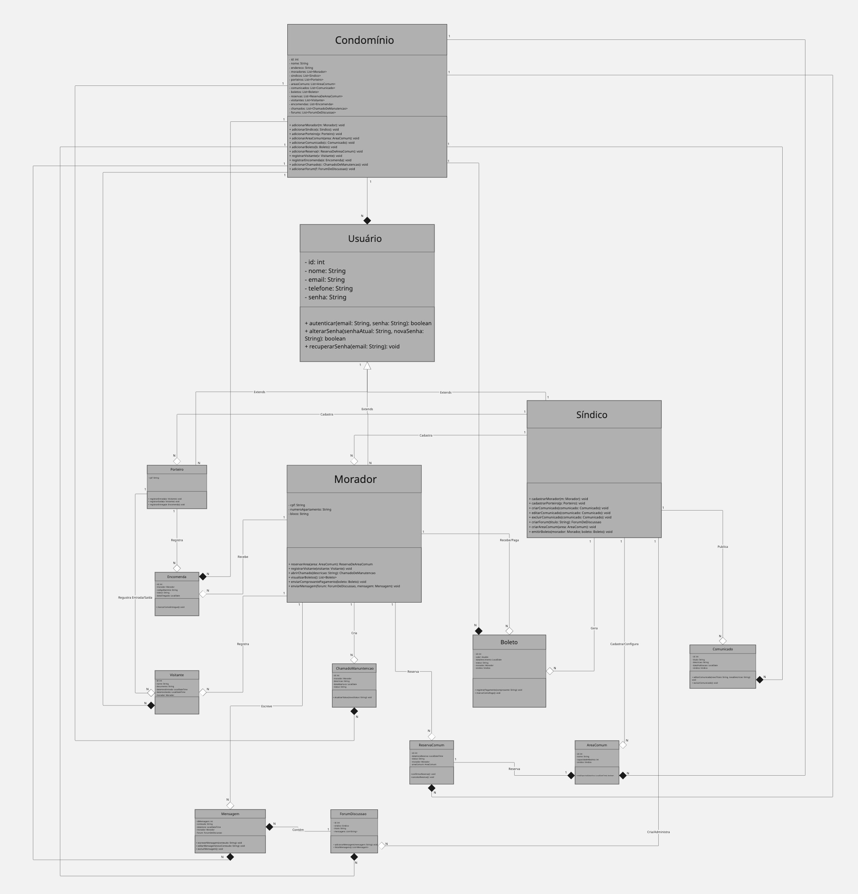
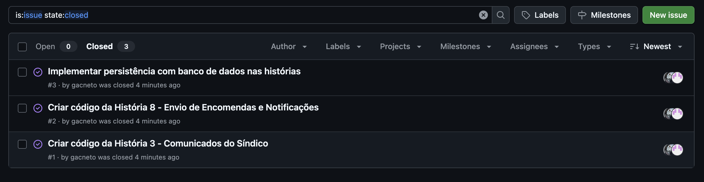
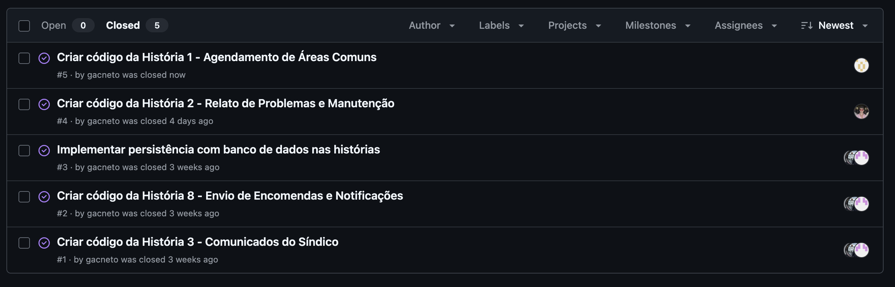
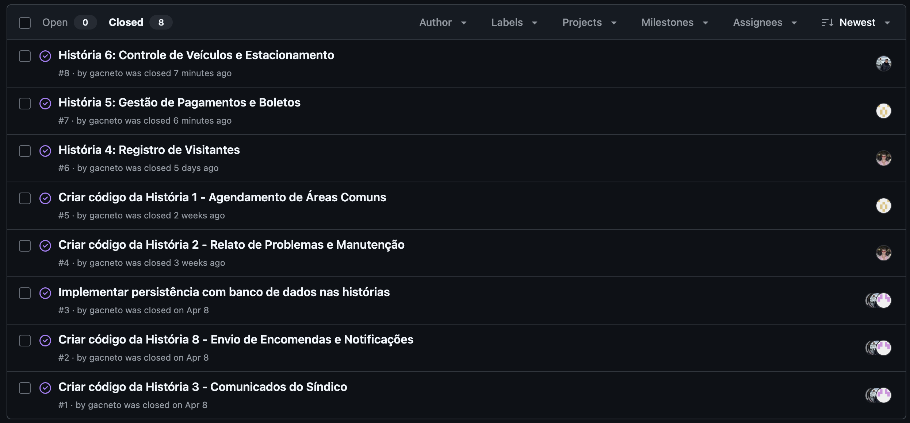

# CondoWise

### 📌 Sobre o Projeto
O CondoWise é um sistema de gestão condominial que facilita a comunicação e a administração do condomínio. Ele permite o agendamento de áreas comuns, controle de visitantes, notificações de encomendas, acompanhamento de boletos e chamados de manutenção. A plataforma centraliza informações e processos, garantindo mais organização, transparência e eficiência para síndicos, porteiros e moradores.

### 🎯 Objetivos
O objetivo do CondoWise é otimizar a gestão condominial, centralizando processos administrativos e melhorando a comunicação entre síndico, porteiros e moradores. A plataforma busca oferecer mais organização, transparência e eficiência na administração do condomínio.

### 📌 Status do Projeto  
✅ **Projeto concluído!**  

### 🚀 Futuras Implementações  
- Desenvolvimento de uma **interface gráfica** (frontend).  
- Melhorias na **usabilidade** e **experiência do usuário**.

### 🛠 Tecnologias Utilizadas  
- Java  
- Spring Boot

### ▶️ Como Rodar o Projeto  

#### ✅ Pré-requisitos:  
- Java JDK 17 ou superior instalado  
- Maven instalado  

#### 🚀 Passos para executar:

```bash
# Clone o repositório
git clone https://github.com/gacneto/CondoWise.git

# Acesse a pasta do projeto
cd CondoWise

# Compile o projeto
mvn clean install

# Execute a aplicação
mvn spring-boot:run
```

### 👨‍💻 Participantes
- **Luca Monteiro de Victor**
- **Lucas Barcelar de Carvalho**
- **João Pedro Gomes Penedo**
- **Tiago Galvão Monteiro**
- **Caio Felipe da Silva Rodrigues**

## 📦 Entrega 01

<details>
  <summary>📌 Clique aqui para expandir os detalhes da Entrega 01</summary>

### 🔗 Link do Miro  

Para uma melhor visualização das entregas do projeto, disponibilizamos os seguintes links:  

📌 [Acesse o link do Miro](https://miro.com/app/board/uXjVIVPEAic=/?share_link_id=157639372026)  → Acesse as histórias de usuário e os protótipos Lo-Fi.  

<br>

### 📖 Histórias de Usuário   

| Nº | Perfil   | Nome da História                          |
|----|---------|------------------------------------------|
| 1  | Morador | Agendamento de Áreas Comuns             |
| 2  | Morador | Relato de Problemas e Manutenção        |
| 3  | Síndico | Comunicados do Síndico                  |
| 4  | Morador | Registro de Visitantes                  |
| 5  | Morador | Gestão de Pagamentos e Boletos         |
| 6  | Morador | Controle de Veículos e Estacionamento  |
| 7  | Morador | Fórum de Discussões                    |
| 8  | Morador | Envio de Encomendas e Notificações     |


As histórias de usuário foram definidas de forma clara e completa, com cenários de validação e entrega de valor bem definida.  
🔗 [Acesse as histórias de usuário escrito](./historias_de_usuario.md)  
🔗 [Acesse as histórias de usuário post-it](Entregaveis/./historias_de_usuario.jpg) 

<br>

### 🎨 Protótipo de Lo-Fi  
O protótipo de baixa fidelidade foi desenvolvido no Figma e está acessível através do link abaixo:  
🔗 [Acesse os protótipos lo-fi](Entregaveis/./prototipos_lo_fi.pdf)  

<br>

### 📹 Apresentação do Protótipo  
Um screencast foi criado para demonstrar o protótipo de baixa fidelidade, incluindo explicação em áudio ou legenda.  
🔗 [Assista ao vídeo no YouTube](https://youtu.be/hg_wGcwuK8I) 

</details>

## 📦 Entrega 02

<details>
  <summary>📌 Clique aqui para expandir os detalhes da Entrega 02</summary>

### ✅ Histórias de Usuário Implementadas  

Nesta entrega, foram implementadas as seguintes histórias de usuário, com interface funcional (texto ou gráfica) e persistência em memória:  

| Nº | Perfil   | Nome da História                          |
|----|---------|------------------------------------------|
| 3  | Comunicado | Publicar comunicados             |
| 8  | Encomenda | Registrar/Receber encomenda                 |

🔗 [Acesse a pasta com os códigos das histórias](./Projeto%203%20workspace)

<br>

### 💻 Versionamento no GitHub  

O projeto está sendo versionado com commits frequentes diretamente na branch `main`, conforme boas práticas de controle de versão.  
🔗 [Acesse o repositório no GitHub](https://github.com/gacneto/CondoWise/activity)  

<br>

### 🧩 Diagrama de Classes  

O diagrama de classes representa a arquitetura completa do sistema, desde a interface do usuário até a camada de persistência.  
📌 Imagem em média resolução:  
  

🔍 Veja abaixo cada classe individualmente para uma melhor visualização:

- 🏢 [Condominio](Entregaveis/./Condominio.png)  
- 👤 [Usuario](Entregaveis/./Usuario.png)  
- 🧑‍💼 [Sindico](Entregaveis/./Sindico.png)  
- 👥 [Morador](Entregaveis/./Morador.png)  
- 🛡️ [Porteiro](Entregaveis/./Porteiro.png)  
- 📦 [Encomenda](Entregaveis/./Encomenda.png)  
- 👤 [Visitante](Entregaveis/./Visitante.png)  
- 🔧 [ChamadoManutencao](Entregaveis/./ChamadoManutencao.png)  
- 💳 [Boleto](Entregaveis/./Boleto.png)  
- 🏕️ [AreaComum](Entregaveis/./AreaComum.png)  
- 📅 [ReservaComum](Entregaveis/./ReservaComum.png)  
- 💬 [Mensagem](Entregaveis/./Mensagem.png)  
- 🗣️ [ForumDiscussao](Entregaveis/./ForumDiscussao.png)  
- 📢 [Comunicado](Entregaveis/./Comunicado.png)  

<br>

### 🐛 Issue Tracker  

O controle de tarefas e bugs está sendo feito por meio do sistema de issues do GitHub.  
📌 Print da tela do issue tracker:  
  
🔗 [Acesse as Issues](https://github.com/gacneto/CondoWise/issues)  

<br>

### 📹 Screencast da Entrega  

Foi produzido um screencast demonstrando o uso do sistema nesta entrega, com áudio explicativo ou legendas.  
🔗 [Assista ao vídeo no YouTube](https://youtu.be/QYOAJ8MYoWI)  

</details>

## 📦 Entrega 03

<details>
  <summary>📌 Clique aqui para expandir os detalhes da Entrega 03</summary>

### ✅ Histórias de Usuário Implementadas  

Nesta entrega, foram implementadas as seguintes histórias de usuário, com interface funcional (texto ou gráfica) e persistência em memória:  

| Nº | Perfil   | Nome da História                          |
|----|---------|------------------------------------------|
| 1  | Agendamento Área Comum | Agendar área comum             |
| 2  | Chamado Manutenção | Relatar Problemas e Manutenção                |

🔗 [Acesse a pasta com os códigos da história 1](./ChamadoManutencao)

🔗 [Acesse a pasta com os códigos da história 2](./Projeto%203%20workspace)


<br>

### 💻 Versionamento no GitHub  

O projeto está sendo versionado com commits frequentes diretamente na branch `main`, conforme boas práticas de controle de versão.  
🔗 [Acesse o repositório no GitHub](https://github.com/gacneto/CondoWise/activity)  

<br>

### 🐛 Issue Tracker  

O controle de tarefas e bugs está sendo feito por meio do sistema de issues do GitHub.  
📌 Print da tela do issue tracker:  
  
🔗 [Acesse as Issues](https://github.com/gacneto/CondoWise/issues)  

<br>

### 📹 Screencast da Entrega  

Foi produzido um screencast referente a História 1 - Agendamento Área Comum, demonstrando o uso do sistema + teste automatizado nesta entrega, com áudio explicativo ou legendas.  
🔗 [Assista ao vídeo no YouTube](https://youtu.be/cVwvAxG7Viw)  

Foi produzido um screencast referente a História 2 - Chamado Manutenção, demonstrando o uso do sistema + teste automatizado nesta entrega, com áudio explicativo ou legendas.  
🔗 [Assista ao vídeo no YouTube](https://youtu.be/RyAI-Ovyhzs) 

</details>

## 📦 Entrega 04

<details>
  <summary>📌 Clique aqui para expandir os detalhes da Entrega 04</summary>

### ✅ Histórias de Usuário Implementadas  

Nesta entrega, foram implementadas as seguintes histórias de usuário, com interface funcional (texto ou gráfica) e persistência em memória:  

| Nº | Perfil   | Nome da História                          |
|----|---------|------------------------------------------|
| 4  | Registro de Visitantes | Registrar a entrada de visitantes             |
| 5  | Gestão de Pagamentos e Boletos | Emitir boletos                |
| 6  | Controle de Veículos e Estacionamento | Cadastrar veículos no sistema                |

🔗 [Acesse a pasta com os códigos da história 4](./RegistrarVisitante)

🔗 [Acesse a pasta com os códigos da história 5](./Projeto%203%20workspace)

🔗 [Acesse a pasta com os códigos da história 6](./controle-veiculos)


<br>

### 💻 Versionamento no GitHub  

O projeto está sendo versionado com commits frequentes diretamente na branch `main`, conforme boas práticas de controle de versão.  
🔗 [Acesse o repositório no GitHub](https://github.com/gacneto/CondoWise/activity)  

<br>

### 🐛 Issue Tracker  

O controle de tarefas e bugs está sendo feito por meio do sistema de issues do GitHub.  
📌 Print da tela do issue tracker:  
  
🔗 [Acesse as Issues](https://github.com/gacneto/CondoWise/issues)   

<br>

### 📹 Screencast da Entrega  

Foi produzido um screencast referente a História 4 - Registro de Visitantes, demonstrando o uso do sistema + teste automatizado nesta entrega, com áudio explicativo ou legendas.  
🔗 [Assista ao vídeo no YouTube](https://youtu.be/Sjvk_430RDg)  

Foi produzido um screencast referente a História 5 - Gestão de Pagamentos e Boletos, demonstrando o uso do sistema + teste automatizado nesta entrega, com áudio explicativo ou legendas.  
🔗 [Assista ao vídeo no YouTube](https://youtu.be/yXY1NMu9HDc) 

Foi produzido um screencast referente a História 6 - Controle de Veículos e Estacionamento, demonstrando o uso do sistema + teste automatizado nesta entrega, com áudio explicativo ou legendas.  
🔗 [Assista ao vídeo no YouTube](https://youtu.be/hxVKNRX9PpU) 

</details>

## 🕑 Cronograma 

<details> 
  <summary>📌 Clique aqui para acessar o nosso cronograma!</summary>

🔗 [Acesse o cronograma no Notion](https://grey-cartoon-38a.notion.site/ebd/1a435e0884138019aa6afa1816602598?v=1a435e088413806ea7f4000c09b2c020)

Nosso cronograma para controle de atividades foi feito através do Notion, tornando possível a atribuição de atividades para cada membro do grupo, assim como a data de início e fim de cada tarefa.

</details>


